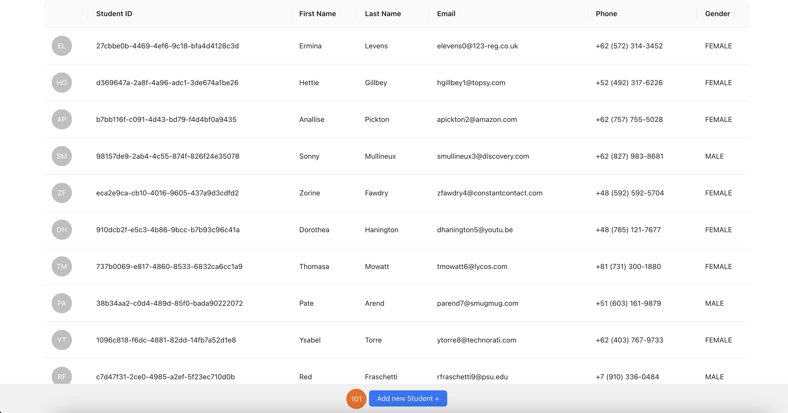
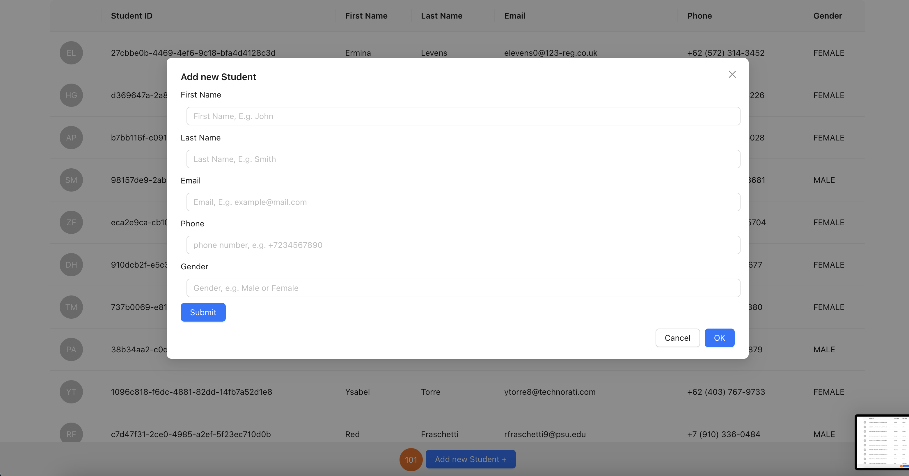
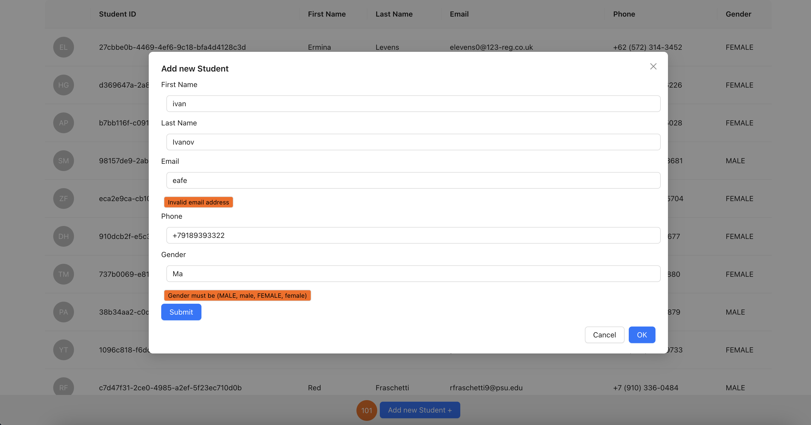

# Full Stack Spring Boot & React Student Management System

Это полнофункциональное веб-приложение для управления данными студентов, построенное с использованием Spring Boot для бэкенда и React для фронтенда.

## Функционал

### 1. Просмотр списка студентов

- Отображение всех студентов в табличном виде
- Информация включает: ID, Имя, Фамилию, Email, Телефон и Пол
- Аватары студентов генерируются автоматически из инициалов

### 2. Добавление нового студента

- Форма для добавления нового студента
- Валидация всех полей:
    - Обязательное заполнение всех полей
    - Проверка формата email
    - Проверка формата телефонного номера
    - Проверка пола (MALE/FEMALE)
- Уведомления об успешном добавлении или ошибках

### 3. Валидация данных

- Проверка уникальности email
- Валидация формата всех полей
- Отображение понятных сообщений об ошибках

## Технический стек

### Backend
- Java 17
- Spring Boot 3.3
- PostgreSQL
- Flyway для миграций базы данных
- JPA/Hibernate
- Maven

### Frontend
- React
- Ant Design (UI компоненты)
- Formik (управление формами)
- Axios (HTTP клиент)

### Развертывание
- Docker
- Docker Compose

## Установка и запуск
Запуск приложения

Запустить Docker
Скачать образ Postgres postgres:latest

Запустить в терминале:
"docker run --name postgres -e POSTGRES_PASSWORD=password -e POSTGRES_USER=postgres -e POSTGRES_DB=postgres -p 127.0.0.1:5432:5432 -d postgres:latest"

